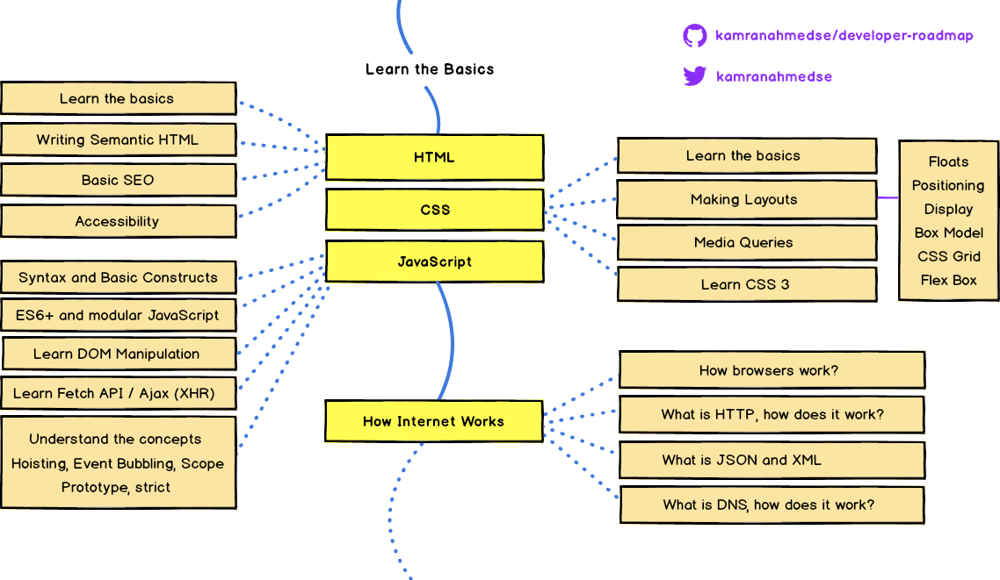

# Introduction to Web Development

This is introduction to web applications development step by step course

Web development today is completely different from what it was a few years ago; there are lots of different things that can easily baffle anyone entering into the web development. It was one of the reasons that we decided to make these step by step [visual guides demonstrating the bigger picture](https://roadmap.sh/frontend) and to give anyone a clear idea about what they have to follow to be in certain roles in web development.

## Required for any path

Required for any path section is very important to familiar with because these as mentioned above in picture it is almost very hard to practice any thing you learn and maintain in place where you easily remind your on material and access world best developers curated materials.

### Introduction to Git Version Control

1. [Version Control System Introduction](https://www.youtube.com/watch?v=zbKdDsNNOhg)
2. [Git is not a deep sh\*t](https://rogerdudler.github.io/git-guide/)
3. [Practical Git for Everyday Professional Use (Video Tutorial)](https://egghead.io/courses/practical-git-for-everyday-professional-use)

### GitHub

1. [Introduction to Git with github](https://product.hubspot.com/blog/git-and-github-tutorial-for-beginners)
2. [Git & GitHub Crash Course For Beginners](https://www.youtube.com/watch?v=SWYqp7iY_Tc)
3. [Exploring GitHub (Video Tutorial)](https://egghead.io/lessons/javascript-exploring-github)

### Basic Terminal Usage

1. [Basic Linux Commands for Beginners](https://maker.pro/linux/tutorial/basic-linux-commands-for-beginners)
2. [How to use the Command Line | Terminal Basic for Begineers](https://www.youtube.com/watch?v=5XgBd6rjuDQ)

### Data Structures & Algorithms

1. [Introduction to Data Structure & Algorithms](https://www.studytonight.com/data-structures/introduction-to-data-structures#:~:text=The%20only%20difference%20being%2C%20data,be%20performed%20on%20it%20easily.)
2. [Data Structure and Algorithms Tutorial](https://www.tutorialspoint.com/data_structures_algorithms/index.htm)

### Licenses

1. [5 types of software licenses you need to understand](https://www.synopsys.com/blogs/software-security/5-types-of-software-licenses-you-need-to-understand/)
2. [Software Licenses (Video)](https://www.youtube.com/watch?v=BbuavSwbZIs)

### Semantic Versioning

1. [Semantic versioning documentation](https://semver.org/)
2. [What is semantic versioning](https://www.youtube.com/watch?v=MdzJuQdjKOE)
3. [Semantic Versioning (Video)](https://www.youtube.com/watch?v=QMUSkra7Blk)

### SSH

1. [SSH Essentials](https://www.digitalocean.com/community/tutorials/ssh-essentials-working-with-ssh-servers-clients-and-keys#:~:text=SSH%20Overview,exists%20on%20the%20remote%20server.)
2. [SSH on the Command Line 1 (video)](https://www.youtube.com/watch?v=rfYZR6opTVg)
3. [SSH on the Command Line 2 (video)](https://www.youtube.com/watch?v=n9QBoXKot40)

### Design Patterns

1. [Design Patterns - Introduction](https://www.geeksforgeeks.org/design-patterns-set-1-introduction/)
2. [Design Patterns video series](https://www.youtube.com/watch?v=v9ejT8FO-7I)

### Character Encodings

1. [What is a character encoding, and why should I care?](https://www.w3.org/International/questions/qa-what-is-encoding)
2. [ASCII and Unicode Character Sets](https://www.youtube.com/watch?v=I-pQH_krD0M)

Oooh, the above stuffs are very boring believe me, but you have to learn it, sorry.

# Frontend

Finally we are starting very interesting phase which is Frontend, boooom.

## HTML

HTML (HyperText Markup Language) is the most basic building block of the Web. It defines the meaning and structure of web content. Other technologies besides HTML are generally used to describe a web page's appearance/presentation (CSS) or functionality/behavior (JavaScript).

### Learning Basic HTML

Programming is not novel to read and enjoy the story, its all about practice. why not you should learn the HTML by using one [free code camp](https://www.freecodecamp.org/learn/) or [w3schools](https://www.w3schools.com/html/default.asp).

### Learning Semantic HTML

A semantic element clearly describes its meaning to both the browser and the developer.

Examples of non-semantic elements: `
` and `` - Tells nothing about its content.

Examples of semantic elements: `<form>`, `<table>`, and `<article>` - Clearly defines its content.

For more detail please visit [semantic elements in HTML](https://www.w3schools.com/html/html5_semantic_elements.asp)

### Some suggested courses you can follow for better understanding of HTML.

1. [HTML Crash Course For Absolute Beginners (Video)](https://www.youtube.com/watch?v=UB1O30fR-EE)
2. [HTML Full Course - Build a Website Tutorial](https://www.youtube.com/watch?v=pQN-pnXPaVg)
3. [A few HTML tips](https://hacks.mozilla.org/2016/08/a-few-html-tips/)
4. [Six tips to set up a better HTML document](https://hackernoon.com/six-tips-to-set-up-a-better-html-document-ud1033z3z)

## CSS

We all love beautiful things around us, what if you can make web application/websites beautiful for the users to love it more than you.

How can we do it?

Don't worry CSS can do it, but you should learn CSS properly otherwise you will hate it more than every think you hate.

With the help of HTML, you create structure for your pages. CSS allows you to style your pages and make them pretty. If you take the analogy of human body, the skeleton would be the HTML, skin would be the CSS and muscles that help us move would be JavaScript - we will learn more about JavaScript in the coming sections.

1. [W3Schools – CSS Tutorial](https://www.w3schools.com/css/)
2. [CSS Crash Course for Absolute Beginners](https://www.youtube.com/watch?v=yfoY53QXEnI)
3. [ Build An HTML5 Website With A Responsive Layout](https://www.youtube.com/watch?v=Wm6CUkswsNw)
4. [Flexbox CSS In 20 Minutes](https://www.youtube.com/watch?v=JJSoEo8JSnc)
5. [CSS Grid Introduction](https://www.youtube.com/playlist?list=PLu8EoSxDXHP5CIFvt9-ze3IngcdAc2xKG)
